# CubeTech E-Commerce

A full-stack e-commerce website with separate customer and admin interfaces, built with React, Express, Prisma, and MySQL.

## Live Links

- **GitHub Repository:** https://github.com/wigglebop25/cubetech-ecommerce-intern
- **Customer Website:** https://cubetech-ecommerce-intern.vercel.app
- **Admin Dashboard:** https://cubetech-ecommerce-intern.vercel.app/admin/login

## Login Credentials

### Admin
- **Username:** `admin`
- **Password:** `admin123`

### Customer
- Register a new account at `/register`
- Or login at `/login`

## Screenshots

### Desktop

| Page | Screenshot |
|------|------------|
| Home Page | 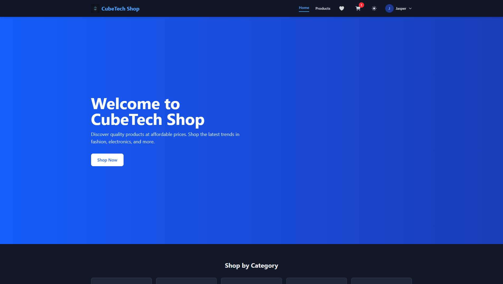 |
| Product Listing | 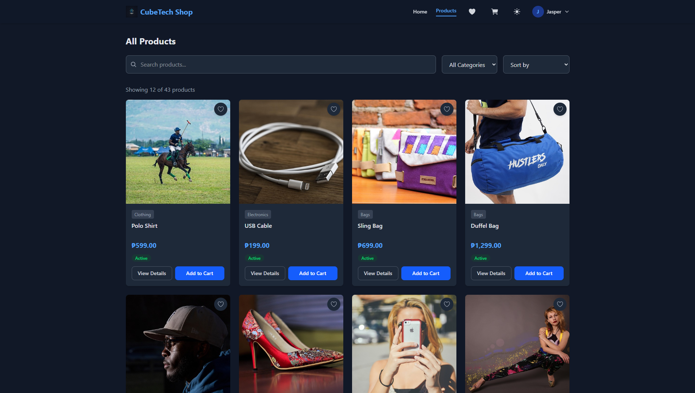 |
| Product Detail | 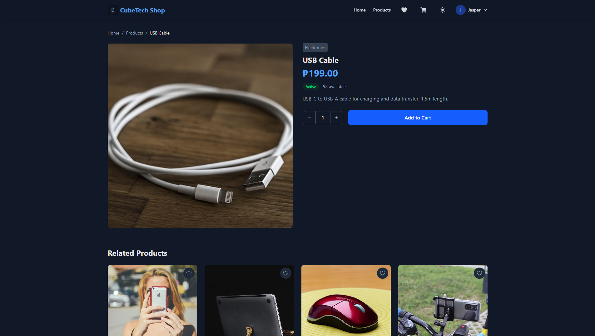 |
| Shopping Cart | 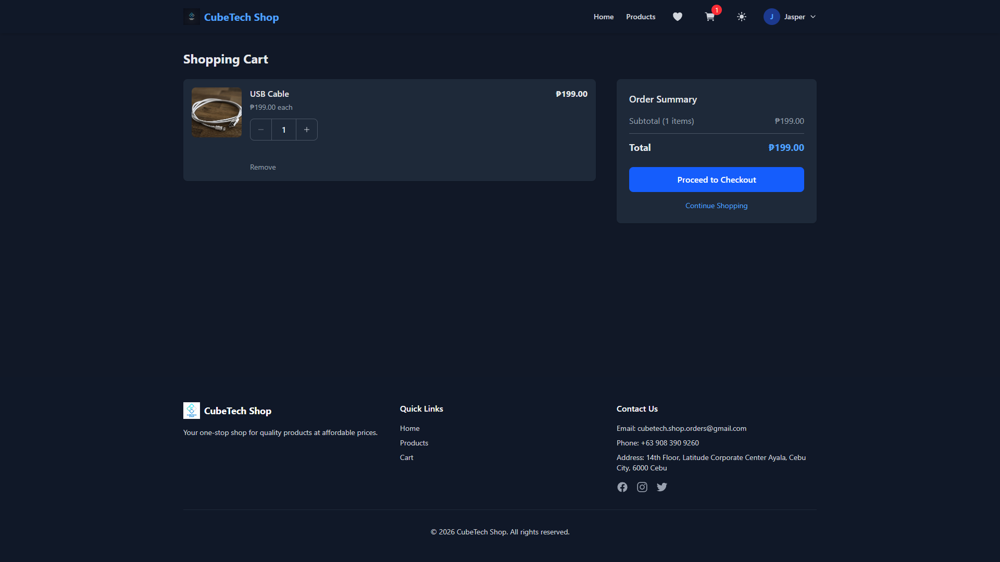 |
| Checkout | 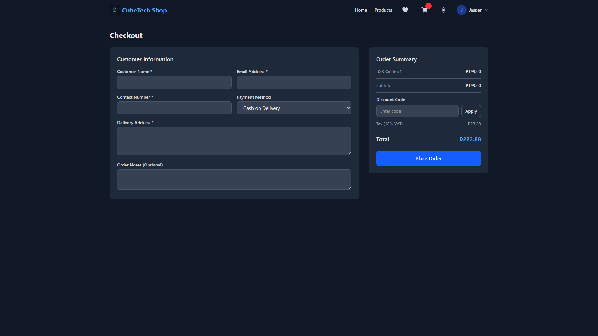 |
| Admin Dashboard | 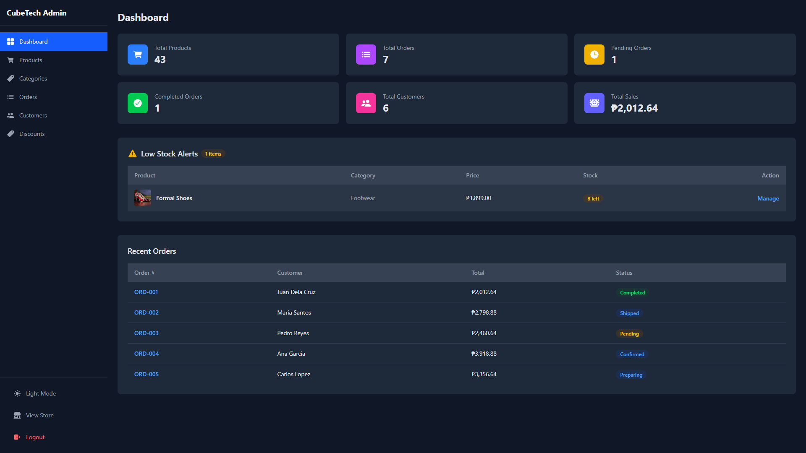 |
| Admin Products | 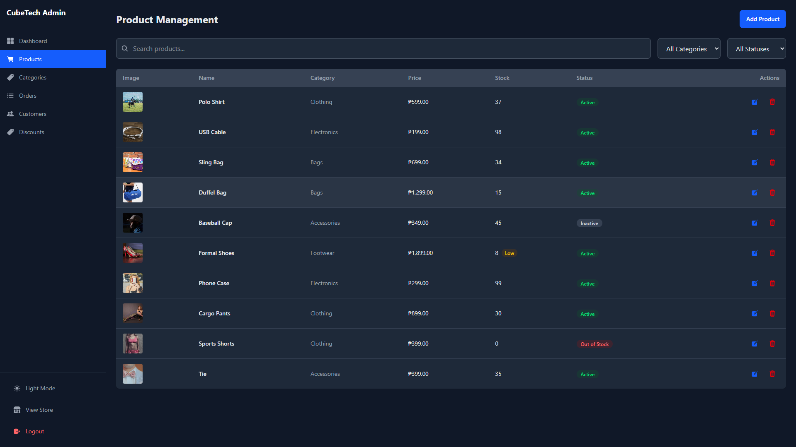 |
| Admin Orders | 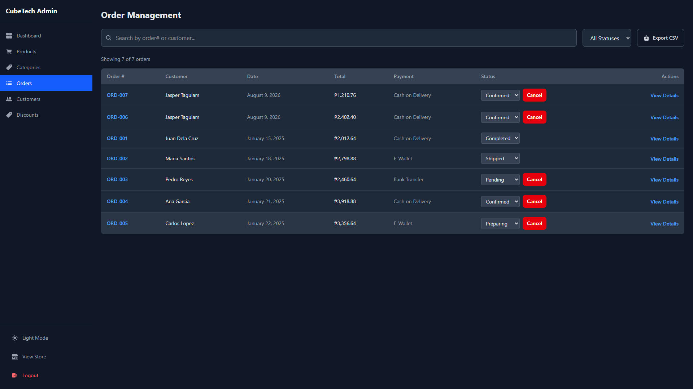 |

### Mobile

| Page | Screenshot |
|------|------------|
| Home Page | 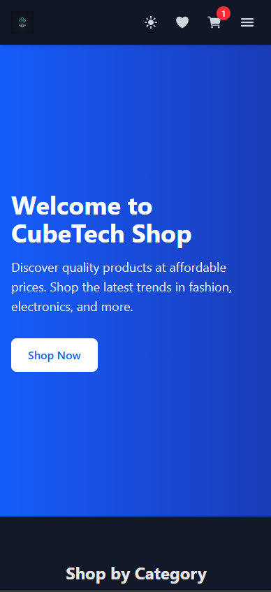 |
| Product Listing | 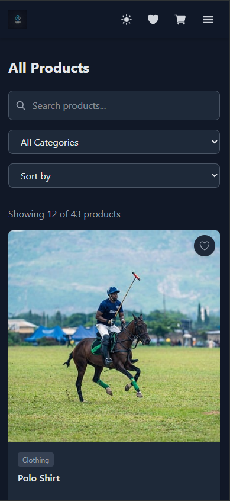 |
| Product Detail | 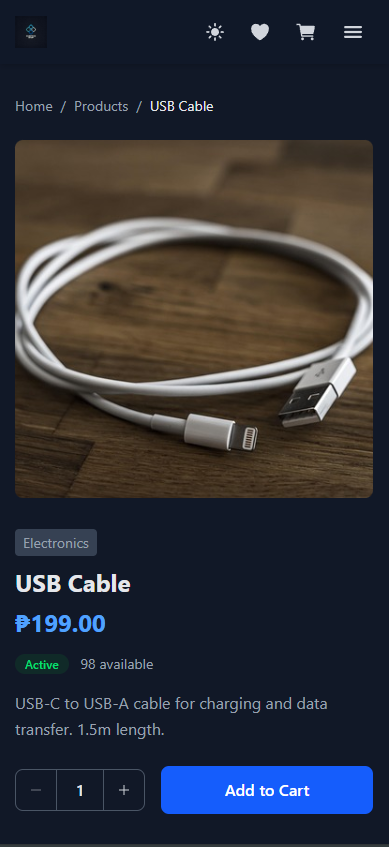 |
| Shopping Cart | 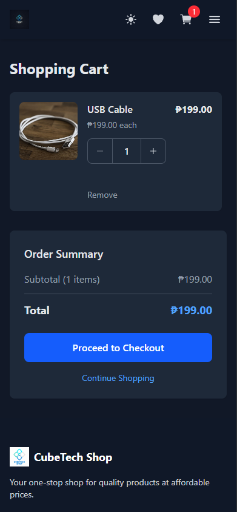 |
| Admin Dashboard | 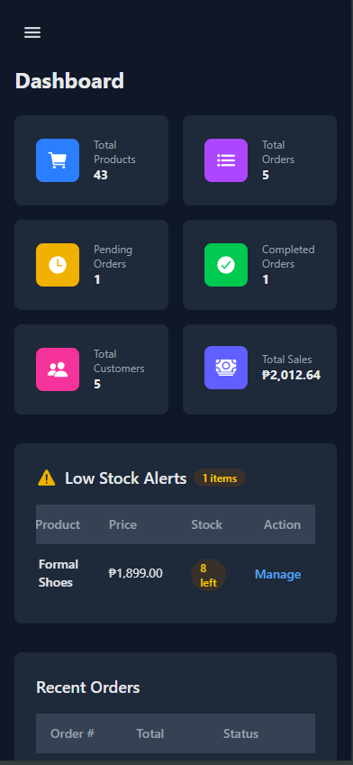 |
| Admin Orders | 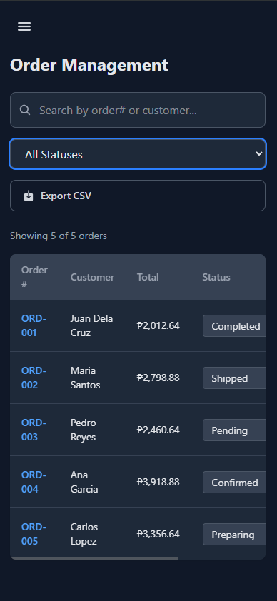 |

## System Flow

### Customer Flow
1. Browse products on home page or product listing
2. Search/filter products by category or price
3. View product details and add to cart
4. Review cart and proceed to checkout
5. Fill in delivery information and payment method
6. Place order and receive confirmation email

### Admin Flow
1. Login to admin dashboard
2. View summary cards and analytics
3. Manage products (add, edit, delete)
4. Manage categories
5. Process orders (update status)
6. View customer information

### Data Flow
- Admin changes (products, categories, orders) are immediately reflected on customer pages
- Customer orders appear in admin order management
- Order status updates are visible to customers

## Tech Stack

**Frontend:**
- React (Vite)
- Tailwind CSS
- React Router v6
- Recharts (admin dashboard charts)
- React Icons

**Backend:**
- Express.js
- Prisma ORM
- MySQL
- Argon2 (password hashing)
- JWT (authentication)
- Nodemailer (email notifications)

## Features

### Customer
- Browse products with search, category filter, and price sorting
- View product details with related products
- Shopping cart with persistence
- Checkout with form validation
- Order confirmation with email notification
- Customer registration and login
- Wishlist management

### Admin
- Dashboard with summary cards and analytics
- Product management (CRUD, image upload, bulk operations)
- Category management with deletion guard
- Order management with status updates
- Customer management
- Role-based access control

### Backend
- RESTful API with Express.js
- Prisma ORM with MySQL
- JWT authentication (admin + customer)
- Argon2 password hashing
- Rate limiting and input sanitization
- Email notifications (Gmail SMTP)
- Health check endpoint

### Bonus Features
- Product image upload (Pixabay API)
- Discount codes (percentage + fixed)
- Wishlist management
- Customer login and registration
- Order tracking with status history
- Sales charts and analytics
- Low-stock alerts
- Export orders to CSV
- Pagination
- Dark mode
- Role-based admin access
- Email order confirmation (Gmail SMTP)
- Loading indicators and skeleton screens

## Prerequisites

- Node.js (v18+)
- MySQL (v8+)

## Setup

### 1. Clone Repository

```bash
git clone https://github.com/wigglebop25/cubetech-ecommerce-intern.git
cd cubetech-ecommerce-intern
```

### 2. Backend Setup

```bash
cd server

# Install dependencies
npm install

# Create MySQL database
mysql -u root -p -e "CREATE DATABASE cubetech_ecommerce;"

# Configure environment variables
# Edit .env file with your MySQL credentials

# Run database migrations
npx prisma migrate dev

# Seed database with sample data
npm run seed

# Start development server
npm run dev
```

Backend runs on `http://localhost:3001`

### 3. Frontend Setup

```bash
cd client

# Install dependencies
npm install

# Start development server
npm run dev
```

Frontend runs on `http://localhost:5173`

## API Endpoints

| Method | Endpoint | Description |
|--------|----------|-------------|
| GET | `/api/health` | Health check |
| POST | `/api/auth/login` | Admin login |
| GET | `/api/products` | List products |
| POST | `/api/products` | Create product |
| PUT | `/api/products/:id` | Update product |
| DELETE | `/api/products/:id` | Delete product |
| GET | `/api/categories` | List categories |
| POST | `/api/categories` | Create category |
| GET | `/api/orders` | List orders |
| POST | `/api/orders` | Create order |
| PUT | `/api/orders/:id/status` | Update order status |
| GET | `/api/customers` | List customers |
| POST | `/api/customers/register` | Customer registration |
| POST | `/api/customers/login` | Customer login |
| GET | `/api/discounts` | List discounts |
| POST | `/api/discounts/validate` | Validate discount code |
| GET | `/api/wishlist` | Get wishlist |
| GET | `/api/analytics/dashboard` | Dashboard analytics |
| GET | `/api/stats` | Dashboard statistics |

## Project Structure

```
cubetech-ecommerce/
├── server/                    # Backend
│   ├── prisma/                # Database schema and migrations
│   ├── src/
│   │   ├── controllers/       # HTTP request handlers
│   │   ├── services/          # Business logic
│   │   ├── repositories/      # Data access layer
│   │   ├── middleware/         # Express middleware
│   │   ├── routes/            # API route definitions
│   │   ├── utils/             # Utility functions
│   │   └── __tests__/         # Unit tests
│   └── uploads/               # Uploaded files
├── client/                    # Frontend
│   ├── src/
│   │   ├── components/        # Reusable UI components
│   │   ├── pages/             # Page components
│   │   ├── context/           # React contexts
│   │   ├── services/          # API service
│   │   ├── hooks/             # Custom hooks
│   │   └── utils/             # Utility functions
│   └── public/                # Static assets
├── screenshots/               # Desktop and mobile screenshots
│   ├── desktop/
│   └── mobile/
└── README.md
```

## Testing

```bash
cd server
npm test
```

All 71 unit tests pass.

## License

This project is for assessment purposes.
